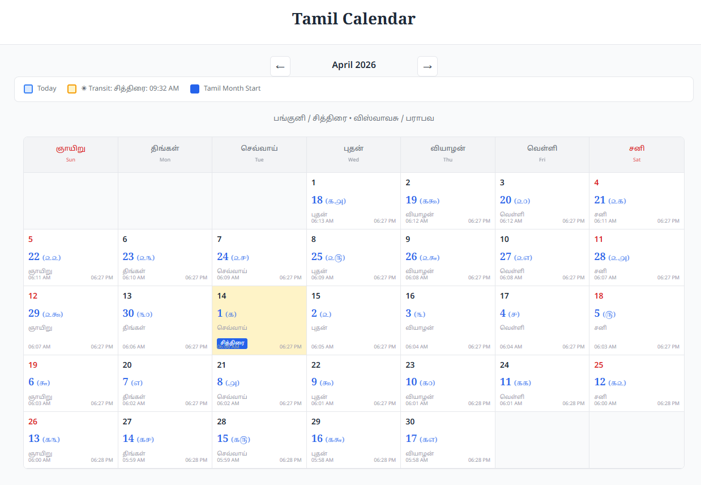

# Tamil Calendar | தமிழ் காலண்டர்

[](https://suryadevworks.github.io/tamilcalendar/)

An open-source Tamil Calendar calculation engine that determines Tamil months, dates, and year cycles using astronomical solar transit calculations.

சூரியன் ராசி மாற்றம், லஹிரி அயனாம்சம் மற்றும் பாரம்பரிய 13 கடிகை விதியை பயன்படுத்தி தமிழ் மாதங்கள், தேதிகள் மற்றும் வருட சுழற்சிகளை கணக்கிடும் திறந்த மூல நிரல்.



---

## Overview | அறிமுகம்

The Tamil Calendar is a **solar-sidereal calendar** based on the movement of the Sun through the 12 zodiac signs. Each Tamil month begins when the Sun enters a new Rasi (zodiac sign).

தமிழ் காலண்டர் என்பது சூரிய-நட்சத்திர காலண்டர் ஆகும். சூரியன் 12 ராசிகளுக்குள் நகர்வதை அடிப்படையாகக் கொண்டு மாதங்கள் கணக்கிடப்படுகின்றன. சூரியன் ஒரு புதிய ராசிக்குள் நுழையும் நேரத்தில் அந்த தமிழ் மாதம் தொடங்குகிறது.

---

## Key Features | முக்கிய அம்சங்கள்

**English:**
- Tamil month calculation from solar transit
- Tamil year (60-year cycle)
- Lahiri Ayanamsa sidereal calculations
- Sunrise-based calendar logic
- Traditional 13-Ghatika rule implementation
- Precise astronomical calculations

**தமிழ்:**
- சூரிய பெயர்ச்சியை அடிப்படையாகக் கொண்டு தமிழ் மாத கணக்கீடு
- 60 வருட தமிழ் வருட சுழற்சி
- லஹிரி அயனாம்சம் பயன்படுத்திய நட்சத்திர கணக்கீடு
- சூரிய உதய அடிப்படையிலான நாள் தீர்மானம்
- பாரம்பரிய 13 கடிகை விதி செயல்படுத்தல்
- துல்லியமான கோளரிதல் கணக்கீடு

---

## How the Calendar is Calculated | காலண்டர் எப்படி கணக்கிடப்படுகிறது

### 1. What is a Tamil Calendar? | தமிழ் காலண்டர் என்றால் என்ன?

The Tamil calendar is a **solar-sidereal calendar** — unlike the Gregorian calendar which is purely solar, the Tamil calendar tracks the Sun's movement through the 12 zodiac signs (Rasis) as measured against the fixed stars (sidereal).

Each Tamil month begins when the Sun enters a new Rasi (zodiac sign). The 12 Tamil months correspond exactly to the 12 Rasis in the sidereal zodiac, starting with Chithirai (Mesha/Aries) and ending with Panguni (Meena/Pisces).

தமிழ் காலண்டர் என்பது ஒரு **சூரிய-நட்சத்திர காலண்டர்** ஆகும். கிரிகோரியன் காலண்டர் வெறும் சூரிய கணக்கை மட்டும் பயன்படுத்துகிறது. ஆனால் தமிழ் காலண்டர் நட்சத்திரங்களை அடிப்படையாக கொண்டு சூரியனின் இயக்கத்தை கணக்கிடுகிறது.

சூரியன் ஒரு புதிய ராசிக்கு நுழையும் நேரத்தில் தமிழ் மாதம் தொடங்குகிறது. 12 தமிழ் மாதங்கள் 12 ராசிகளுக்கு ஒத்திருக்கின்றன — சித்திரை (மேஷம்) முதல் பங்குனி (மீனம்) வரை.

#### The 12 Tamil Months (தமிழ் மாதங்கள்):

சித்திரை (Chithirai / Mesha) · வைகாசி (Vaikasi / Rishabha) · ஆனி (Aani / Mithuna) · ஆடி (Aadi / Kataka) · ஆவணி (Aavani / Simha) · புரட்டாசி (Purattasi / Kanya) · ஐப்பசி (Aippasi / Tula) · கார்த்திகை (Karthigai / Vrischika) · மார்கழி (Margazhi / Dhanus) · தை (Thai / Makara) · மாசி (Maasi / Kumbha) · பங்குனி (Panguni / Meena)

---

### 2. Sidereal vs Tropical — Ayanamsa | நட்சத்திர ராசி vs சூரிய ராசி — அயனாம்சம்

Western astrology uses the *Tropical zodiac* which is tied to the seasons (vernal equinox = 0° Aries). Indian astrology uses the *Sidereal zodiac* tied to actual star positions.

Due to the Earth's axial precession (wobble), the two zodiacs drift apart by about **50.2 arcseconds per year**. The difference between them at any point in time is called the **Ayanamsa**.

We use the **Lahiri Ayanamsa** (the official standard of the Indian government since 1955). In 2025, the Lahiri Ayanamsa is approximately **24.13°**.

மேற்கத்திய ஜோதிடம் *ட்ரோபிகல் ராசிச்சக்கரம்* பயன்படுத்துகிறது — இது பருவகால அடிப்படையில் அமைந்தது. இந்திய ஜோதிடம் *நட்சத்திர ராசிச்சக்கரம்* (சைடிரியல்) பயன்படுத்துகிறது — இது உண்மையான நட்சத்திர நிலைகளை அடிப்படையாக கொண்டது.

பூமியின் அச்சு சுழற்சியால் இந்த இரண்டும் ஆண்டுக்கு **50.2 வினாடிகள்** (arc seconds) வேறுபடுகின்றன. இந்த வேறுபாட்டை **அயனாம்சம்** என்கிறோம்.

நாம் **லஹிரி அயனாம்சம்** பயன்படுத்துகிறோம் — இது 1955 முதல் இந்திய அரசின் அதிகாரப்பூர்வ தரநிலையாக உள்ளது.

#### Formula — சூத்திரம்

```
Sidereal Longitude = Tropical Longitude − Ayanamsa
```

The Sun's tropical longitude (position relative to Earth's seasons) minus the Ayanamsa correction gives the sidereal position (position relative to fixed stars). Dividing this by 30° gives the Rasi number (0=Mesha, 1=Rishabha … 11=Meena).

சூரியனின் ட்ரோபிகல் நிலையிலிருந்து அயனாம்சத்தை கழித்தால் நட்சத்திர நிலை கிடைக்கும். இதை 30-ஆல் வகுத்தால் ராசி கிடைக்கும் (0=மேஷம், 1=ரிஷபம்... 11=மீனம்).

---

### 3. Finding Solar Transit | சூரிய பெயர்ச்சி கண்டறிதல்

We need to find the *exact moment* the Sun crosses from one Rasi into the next. This is the solar transit (Sankranti / சூரிய பெயர்ச்சி).

The calendar uses astronomical calculations to determine when the Sun's sidereal longitude crosses multiples of 30° (0°, 30°, 60°, etc.). Each crossing marks the beginning of a new Tamil month.

This calculation must be extremely precise — an error of even a few minutes can shift the Tamil month start date by an entire day due to the 13-Ghatika rule.

சூரியன் ஒரு ராசியிலிருந்து அடுத்த ராசிக்கு செல்லும் *சரியான நேரத்தை* கண்டறிய வேண்டும். இதை சூரிய பெயர்ச்சி (சங்கராந்தி) என்கிறோம்.

காலண்டர் கணித கணக்கீடுகளை பயன்படுத்தி சூரியனின் நட்சத்திர தீர்க்க நிலை 30°-ன் மடங்குகளை கடக்கும் நேரத்தை கண்டறிகிறது (0°, 30°, 60°, etc.). ஒவ்வொரு கடத்தலும் புதிய தமிழ் மாதத்தின் தொடக்கத்தை குறிக்கிறது.

இந்த கணக்கீடு மிக துல்லியமாக இருக்க வேண்டும் — சில நிமிட பிழை கூட 13 கடிகை விதியால் தமிழ் மாத தொடக்க நாளை மாற்றி விடலாம்.

**Special Case: Pisces → Aries (பங்குனி → சித்திரை)**

The zodiac wraps from 360° back to 0°. When the Sun transitions from Pisces (330°–360°) to Aries (0°–30°), this represents both the end of one zodiac cycle and the beginning of the Tamil New Year (புத்தாண்டு).

ராசிச்சக்கரம் 360°-லிருந்து மீண்டும் 0°-க்கு திரும்புகிறது. பங்குனி முதல் சித்திரை வரை இந்த மாற்றம் நடக்கும்போது ஒரு ராசி சுழற்சி முடிந்து தமிழ் புத்தாண்டு தொடங்குகிறது.

---

### 4. The 13-Ghatika Rule | 13 கடிகை விதி

This is the most important traditional rule for determining which calendar day a Tamil month actually *starts* on. The raw solar transit moment (Sankranti) does not directly equal the start of a Tamil day.

**1 Ghatika = 24 minutes** (traditional Indian time unit)  
**13 Ghatikas = 312 minutes = 5 hours 12 minutes** after sunrise.

**The rule:** If the solar transit occurs *within 312 minutes after sunrise*, that very sunrise-day is Tamil Month Day 1. If it occurs *after* 312 minutes, the *next* day is Tamil Month Day 1.

தமிழ் மாதம் எந்த நாளில் தொடங்குகிறது என்பதை தீர்மானிக்கும் மிக முக்கியமான பாரம்பரிய விதி இது. சூரிய பெயர்ச்சி நேரம் நேரடியாக மாத தொடக்க நாளாக கருதப்படுவதில்லை.

**1 கடிகை = 24 நிமிடங்கள்** (பாரம்பரிய இந்திய கால அளவு).  
**13 கடிகை = 312 நிமிடங்கள் = 5 மணி 12 நிமிடம்** சூரிய உதயத்திற்கு பிறகு.

**விதி:** சூரிய பெயர்ச்சி சூரிய உதயத்திற்கு பிறகு 312 நிமிடங்களுக்குள் நடந்தால், அந்த நாளே மாத முதல் நாள். 312 நிமிடங்களுக்கு பிறகு நடந்தால், அடுத்த நாள் மாத முதல் நாள்.

#### 13-Ghatika Decision Rule | 13 கடிகை தீர்மான விதி

```
Transit ≤ Sunrise + 312 min → Day 1 = Transit Date
Transit > Sunrise + 312 min → Day 1 = Next Day
```

**Example:**  
Chithirai 2025 transit occurred at 3:07 AM on April 14.  
Sunrise on April 14 = 6:05 AM.  
Transit was BEFORE sunrise, well within 312 min after.  
→ April 14 = Chithirai Day 1 ✓

**எடுத்துக்காட்டு:**  
சித்திரை 2025 — ஏப்ரல் 14 அதிகாலை 3:07 மணிக்கு சூரிய பெயர்ச்சி. சூரிய உதயம் 6:05 மணி. பெயர்ச்சி உதயத்திற்கு முன்பே நடந்தது — 312 நிமிட வரம்பிற்குள் → ஏப்ரல் 14 = சித்திரை 1 ✓

**Why This Rule Matters (இந்த விதி ஏன் முக்கியம்)**

The 13-Ghatika rule ensures consistency across Tamil Nadu. Without it, different regions with slightly different sunrise times would observe Tamil months starting on different dates. By using a fixed window after sunrise, the entire region stays synchronized.

13 கடிகை விதி தமிழ்நாடு முழுவதும் ஒரே நாளில் மாத தொடக்கத்தை உறுதி செய்கிறது. இது இல்லாமல், சூரிய உதய நேரம் சற்று வேறுபடும் பகுதிகளில் வெவ்வேறு தேதிகளில் தமிழ் மாதங்கள் தொடங்கும். இந்த நிலையான வரம்பினால் முழு பகுதியும் ஒருங்கிணைந்து இருக்கிறது.

---

### 5. Sunrise Calculation | சூரிய உதய கணக்கீடு

Precise sunrise times are critical — a 2-minute error can shift the Tamil month start by an entire day (due to the 13-Ghatika rule).

The calendar uses **high-precision astronomical calculations** to compute sunrise and sunset times for any location on Earth. These calculations account for atmospheric refraction, elevation above sea level, and the Sun's actual disc center.

சரியான சூரிய உதய நேரம் மிக முக்கியம் — 2 நிமிட பிழை கூட 13 கடிகை விதியால் தமிழ் மாத தொடக்க நாளை மாற்றி விடலாம்.

காலண்டர் **உயர்-துல்லிய கோளரிதல் கணக்கீடுகளை** பயன்படுத்தி பூமியில் எந்த இடத்திற்கும் சூரிய உதய மற்றும் அஸ்தமன நேரத்தை கணக்கிடுகிறது. இந்த கணக்கீடுகள் வளிமண்டல ஒளிவிலகல், கடல் மட்டத்திலிருந்து உயரம் மற்றும் சூரியனின் உண்மையான வட்ட மையத்தை கணக்கில் கொள்கின்றன.

---

### 6. Default Location | இயல்பு இடம்

**Default Coordinates:** 10°56′33.9″N, 78°25′04.5″E

This is the approximate **geographic center of Tamil Nadu**, providing balanced sunrise/sunset times for the entire state.

The default coordinates are **10°56′33.9″N, 78°25′04.5″E** — the approximate **geographic centre point of Tamil Nadu**. This location is chosen deliberately: since Tamil Nadu spans roughly 8°N to 13°N latitude and 77°E to 80°E longitude, using the central point gives a *balanced average sunrise and sunset time* that is reasonably accurate for all districts across the state — neither too early (as it would be for Kanyakumari in the south) nor too late (as it would be for Chennai in the north-east).

இயல்பு ஆயத்தொலைவுகள் **10°56′33.9″வ, 78°25′04.5″கி** — இது தமிழ்நாட்டின் தோராய **புவியியல் மைய புள்ளி** ஆகும். தமிழ்நாடு தெற்கே 8°வ முதல் வடக்கே 13°வ வரையும், மேற்கே 77°கி முதல் கிழக்கே 80°கி வரையும் பரவியுள்ளது. மைய புள்ளியை பயன்படுத்துவதால், மாநிலம் முழுவதும் உள்ள அனைத்து மாவட்டங்களுக்கும் *சராசரி சூரிய உதய மற்றும் அஸ்தமன நேரம்* கிடைக்கிறது — கன்னியாகுமரிக்கு மிகவும் முன்பாகவோ, சென்னைக்கு மிகவும் பிறகாகவோ இல்லாமல், அனைவருக்கும் நடுநிலையாக இருக்கும்.

#### Example Cities | எடுத்துக்காட்டு நகரங்கள்

```python
# Chennai (சென்னை)
DEFAULT_LAT = 13.0827  DEFAULT_LON = 80.2707

# Madurai (மதுரை)
DEFAULT_LAT = 9.9252   DEFAULT_LON = 78.1198

# Coimbatore (கோயம்புத்தூர்)
DEFAULT_LAT = 11.0168  DEFAULT_LON = 76.9558

# Kanyakumari (கன்னியாகுமரி)
DEFAULT_LAT = 8.0883   DEFAULT_LON = 77.5385
```

**To use your own city's coordinates**, replace the values above. You can find any city's latitude and longitude from Google Maps (right-click on the location → the coordinates appear at the top of the popup).

**உங்கள் நகரின் ஆயத்தொலைவுகளை பயன்படுத்த**, மேலே உள்ள மதிப்புகளை மாற்றவும். Google Maps-ல் உங்கள் இடத்தில் வலது கிளிக் செய்யுங்கள் — மேல்பகுதியில் ஆயத்தொலைவுகள் தோன்றும்.

---

### 7. Tamil Year — 60-Year Cycle | தமிழ் வருடம் — 60 வருட சுழற்சி

Tamil years follow a 60-year cycle (Sashti Abdha Poorthi). Each year in the cycle has a unique name. The cycle starts with Prabhava and ends with Akshaya, then repeats.

The Tamil new year starts when the Sun enters Mesha (Chithirai) — usually around April 14th each year. Our anchor: **April 2025 = Visvavasu (விஸ்வாவசு)**, which is index 38 in the 60-year cycle (0-based).

தமிழ் வருடங்கள் 60 ஆண்டு சுழற்சியை (சஷ்டி அப்த பூர்த்தி) பின்பற்றுகின்றன. ஒவ்வொரு வருடத்திற்கும் தனித்துவமான பெயர் உண்டு. பிரபவ என்று தொடங்கி அட்சய என்று முடிந்து மீண்டும் தொடங்குகிறது.

சூரியன் மேஷ ராசிக்கு நுழையும் போது தமிழ் புத்தாண்டு தொடங்குகிறது — பொதுவாக ஏப்ரல் 14 ஆம் தேதி. நமது நங்கூரம்: **ஏப்ரல் 2025 = விஸ்வாவசு**, இது 60 வருட சுழற்சியில் குறியீடு 38 (0-அடிப்படை).

#### Year Calculation | வருட கணக்கீடு

```
Year Index = (38 + Gregorian Year − 2025) mod 60
```

Examples:
- 2024 → index 37 → குரோதி (Krodhi) ✓
- 2025 → index 38 → விஸ்வாவசு (Visvavasu) ✓
- 2026 → index 39 → பராபவ (Parabha) ✓

---

## Requirements | தேவையானவை

- Python 3.10+
- pyswisseph
- flask

Install dependencies:

```bash
pip install pyswisseph flask
```

---

## Project Structure | திட்ட அமைப்பு

```
tamil-calendar/
│
├── tamil_calendar.py   # Core astronomy calculations
│                       # மைய கோளரிதல் கணக்கீடுகள்
│
├── app.py              # Flask API server
│                       # Flask API சேவையகம்
│
└── index.html          # Frontend calendar interface
                        # முன்னணி காலண்டர் இடைமுகம்
```

---

## Running the Application | நிரலை இயக்குவது

### Step 1: Install Python | Python நிறுவுக

Download and install Python 3.10 or newer from **python.org**. During installation on Windows, check *"Add Python to PATH"*. Verify installation:

```bash
python3 --version
```

python.org-லிருந்து Python 3.10 அல்லது புதிய பதிப்பை பதிவிறக்கவும். Windows-ல் நிறுவும்போது *"Add Python to PATH"* என்பதை தேர்ந்தெடுக்கவும்.

### Step 2: Install Required Libraries | தேவையான நூலகங்களை நிறுவுக

Open your terminal and install the required packages:

```bash
pip install pyswisseph flask
```

உங்கள் திட்ட கோப்புறைக்கு செல்லவும். பின் தேவையான தொகுப்புகளை நிறுவுக.

### Step 3: Place the Files | கோப்புகளை வைக்கவும்

Make sure all three files are in the **same folder**:

```
tamil-calendar/
  ├── tamil_calendar.py
  ├── app.py
  └── index.html
```

மூன்று கோப்புகளும் **ஒரே கோப்புறையில்** இருக்க வேண்டும்.

### Step 4: Start the Server | சேவையகத்தை தொடங்கவும்

In your terminal, navigate to the project folder and run:

```bash
cd path/to/tamil-calendar
python3 app.py
```

Output:
```
 * Running on http://127.0.0.1:5050
 * Press CTRL+C to quit
```

திட்ட கோப்புறைக்கு சென்று இயக்கவும்.

### Step 5: Open in Browser | உலாவியில் திறக்கவும்

Open any web browser (Chrome, Firefox, Edge) and go to:

```
http://localhost:5050
```

The calendar will load and calculate the current month's Tamil dates automatically. First load may take a few seconds as it computes solar transits for the year.

எந்த வலை உலாவியிலும் (Chrome, Firefox, Edge) திறந்து இந்த முகவரிக்கு செல்லவும். காலண்டர் தானாக நடப்பு மாதத்தை கணக்கிட்டு காட்டும். முதல் ஏற்றம் சில வினாடிகள் ஆகலாம் — ஆண்டிற்கான சூரிய பெயர்ச்சி நேரங்களை கணக்கிடுவதால்.

---

## Quick Reference | விரைவு குறிப்பு

### Key Constants | முக்கிய மாறிலிகள்

- 1 Ghatika (கடிகை) = **24 minutes (நிமிடம்)**
- 13 Ghatikas = **312 minutes = 5 hrs 12 min**
- Lahiri Ayanamsa (2025) ≈ **24.13°**
- Sun travels ≈ **1° per day** (30° per month)
- Tamil month duration ≈ **29–32 days** (varies by Rasi)
- 60-year cycle anchor: **2025 = விஸ்வாவசு (index 38)**
- Default location: **10.9427°N, 78.4179°E** (centre of Tamil Nadu)

---

## License | உரிமம்

This project is released under the MIT License.

இந்த திட்டம் MIT License கீழ் வெளியிடப்பட்டுள்ளது.

---

<div align="center">

தமிழ் காலண்டர் · சூரிய பெயர்ச்சி அடிப்படையில் · 13 கடிகை விதி

Tamil Calendar · Solar Transit Based · 13-Ghatika Rule

</div># Tamil Calendar | தமிழ் காலண்டர்

An open-source Tamil Calendar calculation engine that determines Tamil months, dates, and year cycles using astronomical solar transit calculations.

சூரியன் ராசி மாற்றம், லஹிரி அயனாம்சம் மற்றும் பாரம்பரிய 13 கடிகை விதியை பயன்படுத்தி தமிழ் மாதங்கள், தேதிகள் மற்றும் வருட சுழற்சிகளை கணக்கிடும் திறந்த மூல நிரல்.


---

## Overview | அறிமுகம்

The Tamil Calendar is a **solar-sidereal calendar** based on the movement of the Sun through the 12 zodiac signs. Each Tamil month begins when the Sun enters a new Rasi (zodiac sign).

தமிழ் காலண்டர் என்பது சூரிய-நட்சத்திர காலண்டர் ஆகும். சூரியன் 12 ராசிகளுக்குள் நகர்வதை அடிப்படையாகக் கொண்டு மாதங்கள் கணக்கிடப்படுகின்றன. சூரியன் ஒரு புதிய ராசிக்குள் நுழையும் நேரத்தில் அந்த தமிழ் மாதம் தொடங்குகிறது.

---

## Key Features | முக்கிய அம்சங்கள்

**English:**
- Tamil month calculation from solar transit
- Tamil year (60-year cycle)
- Lahiri Ayanamsa sidereal calculations
- Sunrise-based calendar logic
- Traditional 13-Ghatika rule implementation
- Precise astronomical calculations

**தமிழ்:**
- சூரிய பெயர்ச்சியை அடிப்படையாகக் கொண்டு தமிழ் மாத கணக்கீடு
- 60 வருட தமிழ் வருட சுழற்சி
- லஹிரி அயனாம்சம் பயன்படுத்திய நட்சத்திர கணக்கீடு
- சூரிய உதய அடிப்படையிலான நாள் தீர்மானம்
- பாரம்பரிய 13 கடிகை விதி செயல்படுத்தல்
- துல்லியமான கோளரிதல் கணக்கீடு

---

## How the Calendar is Calculated | காலண்டர் எப்படி கணக்கிடப்படுகிறது

### 1. What is a Tamil Calendar? | தமிழ் காலண்டர் என்றால் என்ன?

The Tamil calendar is a **solar-sidereal calendar** — unlike the Gregorian calendar which is purely solar, the Tamil calendar tracks the Sun's movement through the 12 zodiac signs (Rasis) as measured against the fixed stars (sidereal).

Each Tamil month begins when the Sun enters a new Rasi (zodiac sign). The 12 Tamil months correspond exactly to the 12 Rasis in the sidereal zodiac, starting with Chithirai (Mesha/Aries) and ending with Panguni (Meena/Pisces).

தமிழ் காலண்டர் என்பது ஒரு **சூரிய-நட்சத்திர காலண்டர்** ஆகும். கிரிகோரியன் காலண்டர் வெறும் சூரிய கணக்கை மட்டும் பயன்படுத்துகிறது. ஆனால் தமிழ் காலண்டர் நட்சத்திரங்களை அடிப்படையாக கொண்டு சூரியனின் இயக்கத்தை கணக்கிடுகிறது.

சூரியன் ஒரு புதிய ராசிக்கு நுழையும் நேரத்தில் தமிழ் மாதம் தொடங்குகிறது. 12 தமிழ் மாதங்கள் 12 ராசிகளுக்கு ஒத்திருக்கின்றன — சித்திரை (மேஷம்) முதல் பங்குனி (மீனம்) வரை.

#### The 12 Tamil Months (தமிழ் மாதங்கள்):

சித்திரை (Chithirai / Mesha) · வைகாசி (Vaikasi / Rishabha) · ஆனி (Aani / Mithuna) · ஆடி (Aadi / Kataka) · ஆவணி (Aavani / Simha) · புரட்டாசி (Purattasi / Kanya) · ஐப்பசி (Aippasi / Tula) · கார்த்திகை (Karthigai / Vrischika) · மார்கழி (Margazhi / Dhanus) · தை (Thai / Makara) · மாசி (Maasi / Kumbha) · பங்குனி (Panguni / Meena)

---

### 2. Sidereal vs Tropical — Ayanamsa | நட்சத்திர ராசி vs சூரிய ராசி — அயனாம்சம்

Western astrology uses the *Tropical zodiac* which is tied to the seasons (vernal equinox = 0° Aries). Indian astrology uses the *Sidereal zodiac* tied to actual star positions.

Due to the Earth's axial precession (wobble), the two zodiacs drift apart by about **50.2 arcseconds per year**. The difference between them at any point in time is called the **Ayanamsa**.

We use the **Lahiri Ayanamsa** (the official standard of the Indian government since 1955). In 2025, the Lahiri Ayanamsa is approximately **24.13°**.

மேற்கத்திய ஜோதிடம் *ட்ரோபிகல் ராசிச்சக்கரம்* பயன்படுத்துகிறது — இது பருவகால அடிப்படையில் அமைந்தது. இந்திய ஜோதிடம் *நட்சத்திர ராசிச்சக்கரம்* (சைடிரியல்) பயன்படுத்துகிறது — இது உண்மையான நட்சத்திர நிலைகளை அடிப்படையாக கொண்டது.

பூமியின் அச்சு சுழற்சியால் இந்த இரண்டும் ஆண்டுக்கு **50.2 வினாடிகள்** (arc seconds) வேறுபடுகின்றன. இந்த வேறுபாட்டை **அயனாம்சம்** என்கிறோம்.

நாம் **லஹிரி அயனாம்சம்** பயன்படுத்துகிறோம் — இது 1955 முதல் இந்திய அரசின் அதிகாரப்பூர்வ தரநிலையாக உள்ளது.

#### Formula — சூத்திரம்

```
Sidereal Longitude = Tropical Longitude − Ayanamsa
```

The Sun's tropical longitude (position relative to Earth's seasons) minus the Ayanamsa correction gives the sidereal position (position relative to fixed stars). Dividing this by 30° gives the Rasi number (0=Mesha, 1=Rishabha … 11=Meena).

சூரியனின் ட்ரோபிகல் நிலையிலிருந்து அயனாம்சத்தை கழித்தால் நட்சத்திர நிலை கிடைக்கும். இதை 30-ஆல் வகுத்தால் ராசி கிடைக்கும் (0=மேஷம், 1=ரிஷபம்... 11=மீனம்).

---

### 3. Finding Solar Transit | சூரிய பெயர்ச்சி கண்டறிதல்

We need to find the *exact moment* the Sun crosses from one Rasi into the next. This is the solar transit (Sankranti / சூரிய பெயர்ச்சி).

The calendar uses astronomical calculations to determine when the Sun's sidereal longitude crosses multiples of 30° (0°, 30°, 60°, etc.). Each crossing marks the beginning of a new Tamil month.

This calculation must be extremely precise — an error of even a few minutes can shift the Tamil month start date by an entire day due to the 13-Ghatika rule.

சூரியன் ஒரு ராசியிலிருந்து அடுத்த ராசிக்கு செல்லும் *சரியான நேரத்தை* கண்டறிய வேண்டும். இதை சூரிய பெயர்ச்சி (சங்கராந்தி) என்கிறோம்.

காலண்டர் கணித கணக்கீடுகளை பயன்படுத்தி சூரியனின் நட்சத்திர தீர்க்க நிலை 30°-ன் மடங்குகளை கடக்கும் நேரத்தை கண்டறிகிறது (0°, 30°, 60°, etc.). ஒவ்வொரு கடத்தலும் புதிய தமிழ் மாதத்தின் தொடக்கத்தை குறிக்கிறது.

இந்த கணக்கீடு மிக துல்லியமாக இருக்க வேண்டும் — சில நிமிட பிழை கூட 13 கடிகை விதியால் தமிழ் மாத தொடக்க நாளை மாற்றி விடலாம்.

**Special Case: Pisces → Aries (பங்குனி → சித்திரை)**

The zodiac wraps from 360° back to 0°. When the Sun transitions from Pisces (330°–360°) to Aries (0°–30°), this represents both the end of one zodiac cycle and the beginning of the Tamil New Year (புத்தாண்டு).

ராசிச்சக்கரம் 360°-லிருந்து மீண்டும் 0°-க்கு திரும்புகிறது. பங்குனி முதல் சித்திரை வரை இந்த மாற்றம் நடக்கும்போது ஒரு ராசி சுழற்சி முடிந்து தமிழ் புத்தாண்டு தொடங்குகிறது.

---

### 4. The 13-Ghatika Rule | 13 கடிகை விதி

This is the most important traditional rule for determining which calendar day a Tamil month actually *starts* on. The raw solar transit moment (Sankranti) does not directly equal the start of a Tamil day.

**1 Ghatika = 24 minutes** (traditional Indian time unit)  
**13 Ghatikas = 312 minutes = 5 hours 12 minutes** after sunrise.

**The rule:** If the solar transit occurs *within 312 minutes after sunrise*, that very sunrise-day is Tamil Month Day 1. If it occurs *after* 312 minutes, the *next* day is Tamil Month Day 1.

தமிழ் மாதம் எந்த நாளில் தொடங்குகிறது என்பதை தீர்மானிக்கும் மிக முக்கியமான பாரம்பரிய விதி இது. சூரிய பெயர்ச்சி நேரம் நேரடியாக மாத தொடக்க நாளாக கருதப்படுவதில்லை.

**1 கடிகை = 24 நிமிடங்கள்** (பாரம்பரிய இந்திய கால அளவு).  
**13 கடிகை = 312 நிமிடங்கள் = 5 மணி 12 நிமிடம்** சூரிய உதயத்திற்கு பிறகு.

**விதி:** சூரிய பெயர்ச்சி சூரிய உதயத்திற்கு பிறகு 312 நிமிடங்களுக்குள் நடந்தால், அந்த நாளே மாத முதல் நாள். 312 நிமிடங்களுக்கு பிறகு நடந்தால், அடுத்த நாள் மாத முதல் நாள்.

#### 13-Ghatika Decision Rule | 13 கடிகை தீர்மான விதி

```
Transit ≤ Sunrise + 312 min → Day 1 = Transit Date
Transit > Sunrise + 312 min → Day 1 = Next Day
```

**Example:**  
Chithirai 2025 transit occurred at 3:07 AM on April 14.  
Sunrise on April 14 = 6:05 AM.  
Transit was BEFORE sunrise, well within 312 min after.  
→ April 14 = Chithirai Day 1 ✓

**எடுத்துக்காட்டு:**  
சித்திரை 2025 — ஏப்ரல் 14 அதிகாலை 3:07 மணிக்கு சூரிய பெயர்ச்சி. சூரிய உதயம் 6:05 மணி. பெயர்ச்சி உதயத்திற்கு முன்பே நடந்தது — 312 நிமிட வரம்பிற்குள் → ஏப்ரல் 14 = சித்திரை 1 ✓

**Why This Rule Matters (இந்த விதி ஏன் முக்கியம்)**

The 13-Ghatika rule ensures consistency across Tamil Nadu. Without it, different regions with slightly different sunrise times would observe Tamil months starting on different dates. By using a fixed window after sunrise, the entire region stays synchronized.

13 கடிகை விதி தமிழ்நாடு முழுவதும் ஒரே நாளில் மாத தொடக்கத்தை உறுதி செய்கிறது. இது இல்லாமல், சூரிய உதய நேரம் சற்று வேறுபடும் பகுதிகளில் வெவ்வேறு தேதிகளில் தமிழ் மாதங்கள் தொடங்கும். இந்த நிலையான வரம்பினால் முழு பகுதியும் ஒருங்கிணைந்து இருக்கிறது.

---

### 5. Sunrise Calculation | சூரிய உதய கணக்கீடு

Precise sunrise times are critical — a 2-minute error can shift the Tamil month start by an entire day (due to the 13-Ghatika rule).

The calendar uses **high-precision astronomical calculations** to compute sunrise and sunset times for any location on Earth. These calculations account for atmospheric refraction, elevation above sea level, and the Sun's actual disc center.

சரியான சூரிய உதய நேரம் மிக முக்கியம் — 2 நிமிட பிழை கூட 13 கடிகை விதியால் தமிழ் மாத தொடக்க நாளை மாற்றி விடலாம்.

காலண்டர் **உயர்-துல்லிய கோளரிதல் கணக்கீடுகளை** பயன்படுத்தி பூமியில் எந்த இடத்திற்கும் சூரிய உதய மற்றும் அஸ்தமன நேரத்தை கணக்கிடுகிறது. இந்த கணக்கீடுகள் வளிமண்டல ஒளிவிலகல், கடல் மட்டத்திலிருந்து உயரம் மற்றும் சூரியனின் உண்மையான வட்ட மையத்தை கணக்கில் கொள்கின்றன.

---

### 6. Default Location | இயல்பு இடம்

**Default Coordinates:** 10°56′33.9″N, 78°25′04.5″E

This is the approximate **geographic center of Tamil Nadu**, providing balanced sunrise/sunset times for the entire state.

The default coordinates are **10°56′33.9″N, 78°25′04.5″E** — the approximate **geographic centre point of Tamil Nadu**. This location is chosen deliberately: since Tamil Nadu spans roughly 8°N to 13°N latitude and 77°E to 80°E longitude, using the central point gives a *balanced average sunrise and sunset time* that is reasonably accurate for all districts across the state — neither too early (as it would be for Kanyakumari in the south) nor too late (as it would be for Chennai in the north-east).

இயல்பு ஆயத்தொலைவுகள் **10°56′33.9″வ, 78°25′04.5″கி** — இது தமிழ்நாட்டின் தோராய **புவியியல் மைய புள்ளி** ஆகும். தமிழ்நாடு தெற்கே 8°வ முதல் வடக்கே 13°வ வரையும், மேற்கே 77°கி முதல் கிழக்கே 80°கி வரையும் பரவியுள்ளது. மைய புள்ளியை பயன்படுத்துவதால், மாநிலம் முழுவதும் உள்ள அனைத்து மாவட்டங்களுக்கும் *சராசரி சூரிய உதய மற்றும் அஸ்தமன நேரம்* கிடைக்கிறது — கன்னியாகுமரிக்கு மிகவும் முன்பாகவோ, சென்னைக்கு மிகவும் பிறகாகவோ இல்லாமல், அனைவருக்கும் நடுநிலையாக இருக்கும்.

#### Example Cities | எடுத்துக்காட்டு நகரங்கள்

```python
# Chennai (சென்னை)
DEFAULT_LAT = 13.0827  DEFAULT_LON = 80.2707

# Madurai (மதுரை)
DEFAULT_LAT = 9.9252   DEFAULT_LON = 78.1198

# Coimbatore (கோயம்புத்தூர்)
DEFAULT_LAT = 11.0168  DEFAULT_LON = 76.9558

# Kanyakumari (கன்னியாகுமரி)
DEFAULT_LAT = 8.0883   DEFAULT_LON = 77.5385
```

**To use your own city's coordinates**, replace the values above. You can find any city's latitude and longitude from Google Maps (right-click on the location → the coordinates appear at the top of the popup).

**உங்கள் நகரின் ஆயத்தொலைவுகளை பயன்படுத்த**, மேலே உள்ள மதிப்புகளை மாற்றவும். Google Maps-ல் உங்கள் இடத்தில் வலது கிளிக் செய்யுங்கள் — மேல்பகுதியில் ஆயத்தொலைவுகள் தோன்றும்.

---

### 7. Tamil Year — 60-Year Cycle | தமிழ் வருடம் — 60 வருட சுழற்சி

Tamil years follow a 60-year cycle (Sashti Abdha Poorthi). Each year in the cycle has a unique name. The cycle starts with Prabhava and ends with Akshaya, then repeats.

The Tamil new year starts when the Sun enters Mesha (Chithirai) — usually around April 14th each year. Our anchor: **April 2025 = Visvavasu (விஸ்வாவசு)**, which is index 38 in the 60-year cycle (0-based).

தமிழ் வருடங்கள் 60 ஆண்டு சுழற்சியை (சஷ்டி அப்த பூர்த்தி) பின்பற்றுகின்றன. ஒவ்வொரு வருடத்திற்கும் தனித்துவமான பெயர் உண்டு. பிரபவ என்று தொடங்கி அட்சய என்று முடிந்து மீண்டும் தொடங்குகிறது.

சூரியன் மேஷ ராசிக்கு நுழையும் போது தமிழ் புத்தாண்டு தொடங்குகிறது — பொதுவாக ஏப்ரல் 14 ஆம் தேதி. நமது நங்கூரம்: **ஏப்ரல் 2025 = விஸ்வாவசு**, இது 60 வருட சுழற்சியில் குறியீடு 38 (0-அடிப்படை).

#### Year Calculation | வருட கணக்கீடு

```
Year Index = (38 + Gregorian Year − 2025) mod 60
```

Examples:
- 2024 → index 37 → குரோதி (Krodhi) ✓
- 2025 → index 38 → விஸ்வாவசு (Visvavasu) ✓
- 2026 → index 39 → பராபவ (Parabha) ✓

---

## Requirements | தேவையானவை

- Python 3.10+
- pyswisseph
- flask

Install dependencies:

```bash
pip install pyswisseph flask
```

---

## Project Structure | திட்ட அமைப்பு

```
tamil-calendar/
│
├── tamil_calendar.py   # Core astronomy calculations
│                       # மைய கோளரிதல் கணக்கீடுகள்
│
├── app.py              # Flask API server
│                       # Flask API சேவையகம்
│
└── index.html          # Frontend calendar interface
                        # முன்னணி காலண்டர் இடைமுகம்
```

---

## Running the Application | நிரலை இயக்குவது

### Step 1: Install Python | Python நிறுவுக

Download and install Python 3.10 or newer from **python.org**. During installation on Windows, check *"Add Python to PATH"*. Verify installation:

```bash
python3 --version
```

python.org-லிருந்து Python 3.10 அல்லது புதிய பதிப்பை பதிவிறக்கவும். Windows-ல் நிறுவும்போது *"Add Python to PATH"* என்பதை தேர்ந்தெடுக்கவும்.

### Step 2: Install Required Libraries | தேவையான நூலகங்களை நிறுவுக

Open your terminal and install the required packages:

```bash
pip install pyswisseph flask
```

உங்கள் திட்ட கோப்புறைக்கு செல்லவும். பின் தேவையான தொகுப்புகளை நிறுவுக.

### Step 3: Place the Files | கோப்புகளை வைக்கவும்

Make sure all three files are in the **same folder**:

```
tamil-calendar/
  ├── tamil_calendar.py
  ├── app.py
  └── index.html
```

மூன்று கோப்புகளும் **ஒரே கோப்புறையில்** இருக்க வேண்டும்.

### Step 4: Start the Server | சேவையகத்தை தொடங்கவும்

In your terminal, navigate to the project folder and run:

```bash
cd path/to/tamil-calendar
python3 app.py
```

Output:
```
 * Running on http://127.0.0.1:5050
 * Press CTRL+C to quit
```

திட்ட கோப்புறைக்கு சென்று இயக்கவும்.

### Step 5: Open in Browser | உலாவியில் திறக்கவும்

Open any web browser (Chrome, Firefox, Edge) and go to:

```
http://localhost:5050
```

The calendar will load and calculate the current month's Tamil dates automatically. First load may take a few seconds as it computes solar transits for the year.

எந்த வலை உலாவியிலும் (Chrome, Firefox, Edge) திறந்து இந்த முகவரிக்கு செல்லவும். காலண்டர் தானாக நடப்பு மாதத்தை கணக்கிட்டு காட்டும். முதல் ஏற்றம் சில வினாடிகள் ஆகலாம் — ஆண்டிற்கான சூரிய பெயர்ச்சி நேரங்களை கணக்கிடுவதால்.

---

## Quick Reference | விரைவு குறிப்பு

### Key Constants | முக்கிய மாறிலிகள்

- 1 Ghatika (கடிகை) = **24 minutes (நிமிடம்)**
- 13 Ghatikas = **312 minutes = 5 hrs 12 min**
- Lahiri Ayanamsa (2025) ≈ **24.13°**
- Sun travels ≈ **1° per day** (30° per month)
- Tamil month duration ≈ **29–32 days** (varies by Rasi)
- 60-year cycle anchor: **2025 = விஸ்வாவசு (index 38)**
- Default location: **10.9427°N, 78.4179°E** (centre of Tamil Nadu)

---

## License | உரிமம்

This project is released under the MIT License.

இந்த திட்டம் MIT License கீழ் வெளியிடப்பட்டுள்ளது.

---

<div align="center">

தமிழ் காலண்டர் · சூரிய பெயர்ச்சி அடிப்படையில் · 13 கடிகை விதி

Tamil Calendar · Solar Transit Based · 13-Ghatika Rule

</div>
